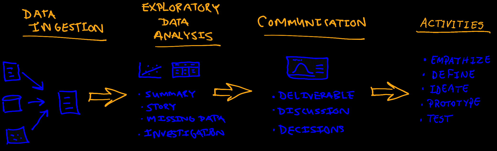

.. learning objectives

.. figure:: ../images/galvanize-logo.png
   :scale: 100%
   :align: center
   :alt: ibm-logo
   :figclass: align-center

EDA - objectives
====================================

Once you have finished with the data wrangling stage for each unit you will be able to:

+-------+----------------------------------------+--------------------+-----------------------------------------------------------------------------------+
| #     | Unit                                   | Week               | Learning Objectives                                                               |
+=======+========================================+====================+===================================================================================+
| 1     | M2 Objectives                          | Data Visualization | Explain the principal steps in exploratory data analysis                          |
+-------+----------------------------------------+--------------------+-----------------------------------------------------------------------------------+
| 2     | Data visualization                     | Data Visualization | Explain the use case for Python tools (pandas, matplotlib, and Jupyter) in EDA    |
+-------+----------------------------------------+--------------------+-----------------------------------------------------------------------------------+
| 3     | Missing values                         | Data Investigation | Describe strategies for dealing with missing data                                 |
+-------+----------------------------------------+--------------------+-----------------------------------------------------------------------------------+
| 4     | CASE STUDY: Data visualization         | Data Visualization | Explain the role of communication in EDA                                          |
+-------+----------------------------------------+--------------------+-----------------------------------------------------------------------------------+
| 5     | TUTORIAL: IBM Watson Studio Dashboard  | Data Visualization | Create a simple dashboard in Watson Studio                                        |
+-------+----------------------------------------+--------------------+-----------------------------------------------------------------------------------+
| 6     | Hypothesis Testing                     | Data Investigation | Explain the investigative role of hypothesis testing in EDA                       |
+-------+----------------------------------------+--------------------+-----------------------------------------------------------------------------------+
| 7     | CASE STUDY: multiple testing           | Data Investigation | Explain several methods for dealing with multiple testing                         |
+-------+----------------------------------------+--------------------+-----------------------------------------------------------------------------------+

|

.. raw:: html

    <iframe src="https://player.vimeo.com/video/349925868" width="600" height="400"  frameborder="0" allowfullscreen></iframe>

|

https://vimeo.com/galvanizehq/review/349925868/5b01aa5222

Why is exploratory data analysis necessary?
----------------------------------------------

`Exploratory Data Analysis (EDA) <https://en.wikipedia.org/wiki/Exploratory_data_analysis>`_ is a *de-facto* standard
part of the data science workflow. The goals of this part of the process vary with the given data and business opportunity,
but in general 
practitioners use visualization tools, tabular summaries and hypothesis testing in order to:

1. Provide summary level insight into a data set
2. Uncover underlying patterns and structure in the data
3. Identify outliers, missing data and class balance issues
4. Carry out quality control checks

Let's use a movie example to help explain why this part of the process is so important.

Imagine you are part of a group of friends who decide to go to a movie with an unfamiliar title. This decision will likely
lead the friends to ask a lot of questions.  To get some answers they might learn about the cast, the crew, the reviews.
It turns out website rotten tomatoes has already done much of this EDA for you.  It provides summary statistics, production
shots and a link to the trailer.  It goes without saying that these visuals will factor heavily into how you perceive the
yet unseen film.

The movie analogy has similarities to the AI workflow.  Before committing to a modeling procedure (in this case the movie),
which is generally time-consuming you will explore some of the evidence that is available to support such a decision.
Some models can be created and deployed in less than an hour, but others can consume days, weeks or possibly more of your
time.  If the next movie you wanted to go see was the first in a lengthy trilogy you might invest even more time exploring.

The time spent on a project is a part of the investment a company makes to pursue a business opportunity.  EDA serves to
maximize the efficiency of your overall time spent on a project.  We will use IBM Watson studio and other state-of-the art
tools to formalize the investigation of business opportunities.  At the end of this stage it will be time to communicate
your findings to business stakeholders.  Communicating your findings is a step that is just as important as the EDA itself.

.. important::

   For some business opportunities, a sound solution can be easily identified through thoughtful data visualization.  Models are
   not always a part of the AI workflow

Data scientists are largely familiar with EDA, its benefits and its place in the overall AI workflow, but this is one part
of the workflow that will always have room for improvement.  **Data visualization** and **results communication** are both
analogous to downhill skiing---in just a few tries you can obtain the minimum level of proficiency, but it takes many
years to become an expert.  One challenge on the road to proficiency is the many options in how data can be visualized and
similarly how results can be communicated.  The general procedure for EDA has several aspects that are consistent despite the
variation.

The above graphic depicts how EDA fits into the overall workflow.  This process can be exemplified as follows:

.. admonition:: Example EDA Process

   1. Load data into pandas, NumPy or another similar tool and **summarize the data**
   2. Use tables, text and visualizations to **tell the story** that relates the business opportunity to the data
   3. Identify a strategy to **deal with missing values**
   4. **Investigate** the data and underlying business scenario with visualizations and hypothesis testing
   5. **Communicate your findings**

.. important:: The AI enterprise workflow does not end here because communication is not an endpoint.  Instead, it is a milestone in the overall workflow, the first of many such milestones.  Keeping stakeholders informed as the workflow proceeds is a critical component for  overall project success and the end of EDA is a natural time to communicate progress.  Reporting your EDA findings in a design thinking playback meeting allows you to validate your findings with others and gain further insights from domain experts.

.. admonition:: CFU

   Which of the following is statements is the least correct in the context of the EDA process

   .. container:: toggle

      .. container:: header

         * **(A)**: EDA is used to provide summary level insight into a dataset
         * **(B)**: EDA consists of both exploratory and confirmatory data analysis
         * **(C)**: EDA can be used to discover missing data, outliers and class inbalance issues
         * **(D)**: The EDA process can be used to help predict time to completion for a project
         * **(E)**: The EDA process is an ideal time to explore the connection between the data and the business opportunity

      **ANSWER**:

         **(B)** John Tukey made the important distinction between `exploratory data analysis` and `confirmatory data analysis`
         in the 1960's.  All of the other answers are reasons to spend time exploring the data.  Diving too quickly into
         the modelling part may not be the most effective way to complete a successful project.
