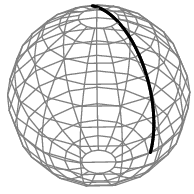

.. hpc

****************
Subprocessing
****************

Once you have finished with the **subprocessing** unit we expect that you will
be able to:

+------+------------------------------+-------------------------------------------------------------------------+
| 1    | Subprocessing                | Use the subprocess module to optimize python and other types of code    |
+------+------------------------------+-------------------------------------------------------------------------+

Global Interpreter Lock (GIL)
===============================

The GIL restricts execution of python bytecodes to a single core, making pure Python threads an ineffective tool for distributing
CPU bound work across multiple cores.

How do we get around this?

   * use a parallel execution technique other than shared memory threading
      * **multiprocessing**
      * **subprocessing** 
   * move parts of the application out into binary extension modules

`see blog for more <http://python-notes.curiousefficiency.org/en/latest/python3/multicore_python.html>`_
     
The great circle problem
===========================

We will be re-using the `Great Circle <http://mathworld.wolfram.com/GreatCircle.html>`_ problem to
illustrate several the different methods to speed up code.

Essentially, the objective is to calculate the shortest distance between two points on
a sphere (I.e., on planet earth).

	   			 	   
R function
================

.. code-block:: r

  greatCircle <- function(lon1,lat1,lon2,lat2){
      radius <- 3956 #miles
      x <- pi/180.0
      a <- (90.0-lat1)*(x)
      b <- (90.0-lat2)*(x)
      theta <- (lon2-lon1)*(x)
      c <- acos((cos(a)*cos(b)) + (sin(a)*sin(b)*cos(theta)))
      return(radius*c)
  }

Python function
=================

.. code-block:: python

   def great_circle(args):
       lon1,lat1,lon2,lat2 = args
       radius = 3956
       x = np.pi/180.0
       a,b = (90.0-lat1)*(x),(90.0-lat2)*(x)
       theta = (lon2-lon1)*(x)
       c =  np.arccos((np.cos(a)*np.cos(b)) +
                     (np.sin(a)*np.sin(b)*np.cos(theta)))
       return radius*c
		
How far is the distance from Machu Picchu to Pikes Peak?
===========================================================

.. code-block:: python

   from GreatCircle import great_circle
   print(great_circle(-13,73,-105,38))

How about for 1,000,000 scenarios on random distances?

.. code-block:: python
		
   import numpy as np 

   n = 1000000
   m = np.random.randint(-360,360,n*4).reshape(n,4)
   
Then to loop through the matrix calculation:

.. code-block:: python

  for i in range(mat.shape[0]):
      x = great_circle(mat[i,:])

Can you think of any tools that you might already have?

NumPy is fast when we are in the matrix world
================================================

It is generally inefficient to loop.  Use `NumPy <http://www.numpy.org>`_ 

.. code-block:: python

   def great_circle_numpy(mat):
       """numpy great circle"""
       radius = 3956
       x = np.pi/180.0
       lon1 = mat[:,0]
       lat1 = mat[:,1]
       lon2 = mat[:,2]
       lat2 = mat[:,3]

       a = (90.0-lat1)*(x)
       b = (90.0-lat2)*(x)
       theta = (lon2-lon1)*(x)
       c = np.arccos((np.cos(a)*np.cos(b)) +
                     (np.sin(a)*np.sin(b)*np.cos(theta)))
       return radius*c

To run the code you could use:
       
.. code-block:: python

    timeStart = time.time()
    c = great_circle_numpy(mat)
    runTime = time.time() - timeStart
    print time.strftime('%H:%M:%S', time.gmtime(runTime))

    
In R there are the apply functions, which improve speed where looping is concerned.

.. admonition:: Self-check
		
   Consider if your problem consists of only matrix operations or other calculations.

Subprocesses
===============

The following code demonstrates subprocesses:

.. code-block:: python

   import subprocess

   # run R
   timeStart = time.time()
   cmd = 'Rscript RunGreatCircle.R'
   proc = subprocess.call(cmd,shell=True)
   runTime = time.time() - timeStart
   print("R time", time.strftime('%H:%M:%S', time.gmtime(runTime)))

   # run python
   timeStart = time.time()
   cmd = 'python RunGreatCircle.py'
   proc = subprocess.call(cmd,shell=True)
   runTime = time.time() - timeStart
   print("Python time", time.strftime('%H:%M:%S', time.gmtime(runTime)))

What about in R?
====================

.. code-block:: r

   system("Rscript RunGreatCircle.R")
   system("python RunGreatCircle.py")

There are more controls from within the system command that can be explored through documentation:

.. code-block:: r

   ?system

Thinking in parallel context
================================

You could use subprocessing in the following way:

   1. Save the whole matrix as a file e.g. csv
   2. Break the file into wedges (1 for each core)
   3. Change the RunScript to accept options for begin, end and wedge (-b, -e, -w)
   4. Ensure the RunScript produces an outfile with an appropriate wedge id
   5. Run it
   6. Once finished reassemble all wedges into the full outfile.

.. literalinclude:: ./scripts/handle-args.py

.. admonition:: Assignment

    Subprocessing can be important when using Python as a glue
    language and at other times.  There is a lot you can do with
    subprocesses, but for the assignment the ask is as follows:

    1. Add the `great_circle` and `great_circle_numpy` functions to your library.
    2. Create an `if __name__ == "__main__"` block that runs both versions of the great circle calculation. (`reference <www.geeksforgeeks.org/what-does-the-if-__name__-__main__-do/>`_)
    3. Use subprocessing to run the file from your run file.
    
