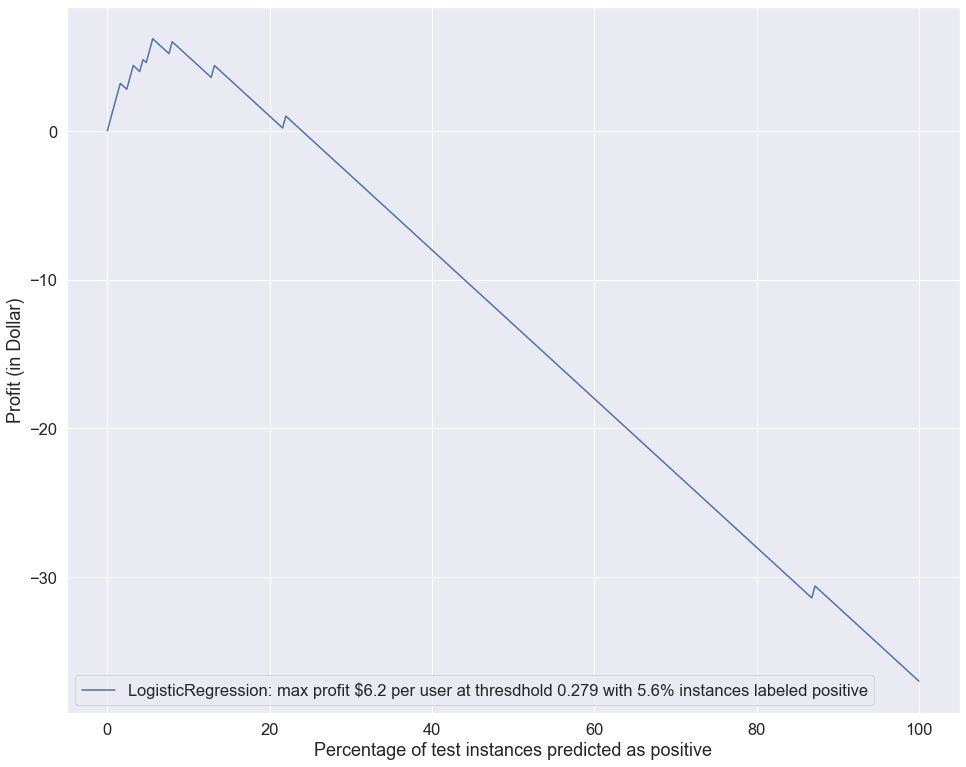

.. imbalanced classes

*************************************   
Profit Curves
*************************************

Learning Objectives
======================

+---------+------------------------------+--------------------------------------------------------------------------+
| Section | Main Topics                  | Learning Objectives                                                      |
+=========+==============================+==========================================================================+
| 1       | Confusion Matrix             | Explain confusion matrix as a function of classification threshold       |
+---------+------------------------------+--------------------------------------------------------------------------+
| 2       | Cost Benefit Matrix          | Quantify the cost/benefit of FP, FN / TP, TN in business setting         |
+---------+------------------------------+--------------------------------------------------------------------------+
| 3       | Profit Curve                 | Construct profit curve by confusion matrix and cost benefit matrix       |
+---------+------------------------------+--------------------------------------------------------------------------+

After building several classification models, you are facing the decision on which model(s) you should choose for production. Besides considering metrics such as accuracy, precision, recall, f1 and AUC, you mostly concern how these models will affect your business decision and what cost benefit they will render. This is exactly what profit curve can offer. It helps you to answer important business questions such as

- What is the maximum profit (in dollar amount!) each classification model render?

- What is the upfront cost to adopt a perticular model?

Section 1: Confusion matrix as a function of classification threshold
========================================================================

To make our discussion solid, we walk through a classification problem
to predict credit card fraud, using a synthetic dataset.

Importing packages
------------------

.. code:: ipython3

    import pandas as pd
    import numpy as np
    from sklearn.preprocessing import StandardScaler
    from sklearn.model_selection import train_test_split, KFold, StratifiedKFold, cross_val_score
    from sklearn.datasets import make_classification
    from sklearn.naive_bayes import GaussianNB
    from sklearn.neighbors import KNeighborsClassifier
    from sklearn.linear_model import LogisticRegression
    from sklearn import metrics
    from sklearn.metrics import precision_recall_curve, roc_curve, confusion_matrix, classification_report
    from sklearn.utils import resample
    from sklearn.utils.class_weight import compute_class_weight
    
    import matplotlib.pyplot as plt

Creating a synthetic data set for credit card fraud detection
-------------------------------------------------------------

Suppose that we have a credit card data set of 1000 instances, each has
20 features and a target label, among which 5% are fraud (with value
1) and 95% non-fraud (with value 0). We can use ``sklearn`` function
``make_classification()`` to create such a data set.

.. code:: ipython3

    X, y= make_classification(n_classes=2,
                              weights=[.95, .05], # majority are non-fraud, minority are fraud
                              n_features=20,
                              n_samples=1000,
                              random_state=23
                             )

.. code:: ipython3

    X.shape

.. parsed-literal::

    (1000, 20)

.. code:: ipython3

    pd.Series(y).value_counts()

.. parsed-literal::

    0    949
    1     51
    dtype: int64

.. code:: ipython3

    # split the data into train and test
    X_train, X_test, y_train, y_test = train_test_split(X, y, test_size=.25, stratify=y, random_state=123)
    
    # normalize the data after the splitting
    scaler = StandardScaler()
    X_train = scaler.fit_transform(X_train)
    X_test = scaler.transform(X_test)

.. note::

    1. Our data is highly imbalanced, with majority non-fraud and miority
       fault. When we split the data into train and test using
       ``train_test_split()``, we stratify the spliting by setting
       ``stratify=y``, so that each class (both minority and majority) will
       be evenly distributed in the train set and the test set.

    2. Though scaling the feature data X is optional, it’s usually a best
       practice for many ML algorithms. We need to **scale the data AFTER the
       train test split**, using only the data from the training set. This is
       because the test set plays the role of fresh unseen data, so it’s not
       supposed to be accessible at the training stage. Using any
       information coming from the test set before or during training is a
       potential bias in the evaluation of the performance.

.. code:: ipython3

    tmp = pd.Series(y_train).value_counts()
    
    #portion of minority in train
    tmp[1]/sum(tmp)

.. parsed-literal::

    0.050666666666666665

.. code:: ipython3

    tmp = pd.Series(y_test).value_counts()
    
    #portion of minority in test
    tmp[1]/sum(tmp)

.. parsed-literal::

    0.052

.. code:: ipython3

    # We train a simple model
    model = LogisticRegression()
    model.fit(X_train, y_train)

.. parsed-literal::

    LogisticRegression(C=1.0, class_weight=None, dual=False, fit_intercept=True,
                       intercept_scaling=1, l1_ratio=None, max_iter=100,
                       multi_class='auto', n_jobs=None, penalty='l2',
                       random_state=None, solver='lbfgs', tol=0.0001, verbose=0,
                       warm_start=False)

.. code:: ipython3

    y_pred = model.predict(X_test)
    y_prob = model.predict_proba(X_test)
    
    #show how y_pred is related to y_prob
    pd.DataFrame({'label':y_pred[:20] ,'prob(y=0)': y_prob[:20, 1]})

.. raw:: html

    

    
    <table border="1" class="dataframe">
      <thead>
        <tr style="text-align: right;">
          <th></th>
          <th>label</th>
          <th>prob(y=0)</th>
        </tr>
      </thead>
      <tbody>
        <tr>
          <th>0</th>
          <td>0</td>
          <td>0.015959</td>
        </tr>
        <tr>
          <th>1</th>
          <td>0</td>
          <td>0.000086</td>
        </tr>
        <tr>
          <th>2</th>
          <td>0</td>
          <td>0.000157</td>
        </tr>
        <tr>
          <th>3</th>
          <td>0</td>
          <td>0.000038</td>
        </tr>
        <tr>
          <th>4</th>
          <td>0</td>
          <td>0.007308</td>
        </tr>
        <tr>
          <th>5</th>
          <td>0</td>
          <td>0.000673</td>
        </tr>
        <tr>
          <th>6</th>
          <td>0</td>
          <td>0.000306</td>
        </tr>
        <tr>
          <th>7</th>
          <td>0</td>
          <td>0.000043</td>
        </tr>
        <tr>
          <th>8</th>
          <td>0</td>
          <td>0.000307</td>
        </tr>
        <tr>
          <th>9</th>
          <td>0</td>
          <td>0.000184</td>
        </tr>
        <tr>
          <th>10</th>
          <td>1</td>
          <td>0.744753</td>
        </tr>
        <tr>
          <th>11</th>
          <td>0</td>
          <td>0.000679</td>
        </tr>
        <tr>
          <th>12</th>
          <td>0</td>
          <td>0.021966</td>
        </tr>
        <tr>
          <th>13</th>
          <td>0</td>
          <td>0.060752</td>
        </tr>
        <tr>
          <th>14</th>
          <td>0</td>
          <td>0.008082</td>
        </tr>
        <tr>
          <th>15</th>
          <td>0</td>
          <td>0.004602</td>
        </tr>
        <tr>
          <th>16</th>
          <td>0</td>
          <td>0.004157</td>
        </tr>
        <tr>
          <th>17</th>
          <td>0</td>
          <td>0.000882</td>
        </tr>
        <tr>
          <th>18</th>
          <td>0</td>
          <td>0.003219</td>
        </tr>
        <tr>
          <th>19</th>
          <td>0</td>
          <td>0.000129</td>
        </tr>
      </tbody>
    </table>
    

By default, the classification threshold is set to be 0.5. By such
default, a instance will be labeled as positive if its predicted
probability of being positive (y_prob[,1]) is greater than 0.5. The
classification threshold has trememdous influcence on how many instance
would be labled as positive, therefore affecting the values in both the
confusion matrix and all its derided metrics (accuracy, precision, recall, F1 etc.)

Here we show that y_pred is derived from y_prob by using the default classification threshold 0.5.

.. code:: ipython3

   
    a = y_prob[:,1]>0.5
    b = y_pred 
    
    a==b

.. parsed-literal::

    array([ True,  True,  True,  True,  True,  True,  True,  True,  True,
            True,  True,  True,  True,  True,  True,  True,  True,  True,
            True,  True,  True,  True,  True,  True,  True,  True,  True,
            True,  True,  True,  True,  True,  True,  True,  True,  True,
            True,  True,  True,  True,  True,  True,  True,  True,  True,
            True,  True,  True,  True,  True,  True,  True,  True,  True,
            True,  True,  True,  True,  True,  True,  True,  True,  True,
            True,  True,  True,  True,  True,  True,  True,  True,  True,
            True,  True,  True,  True,  True,  True,  True,  True,  True,
            True,  True,  True,  True,  True,  True,  True,  True,  True,
            True,  True,  True,  True,  True,  True,  True,  True,  True,
            True,  True,  True,  True,  True,  True,  True,  True,  True,
            True,  True,  True,  True,  True,  True,  True,  True,  True,
            True,  True,  True,  True,  True,  True,  True,  True,  True,
            True,  True,  True,  True,  True,  True,  True,  True,  True,
            True,  True,  True,  True,  True,  True,  True,  True,  True,
            True,  True,  True,  True,  True,  True,  True,  True,  True,
            True,  True,  True,  True,  True,  True,  True,  True,  True,
            True,  True,  True,  True,  True,  True,  True,  True,  True,
            True,  True,  True,  True,  True,  True,  True,  True,  True,
            True,  True,  True,  True,  True,  True,  True,  True,  True,
            True,  True,  True,  True,  True,  True,  True,  True,  True,
            True,  True,  True,  True,  True,  True,  True,  True,  True,
            True,  True,  True,  True,  True,  True,  True,  True,  True,
            True,  True,  True,  True,  True,  True,  True,  True,  True,
            True,  True,  True,  True,  True,  True,  True,  True,  True,
            True,  True,  True,  True,  True,  True,  True,  True,  True,
            True,  True,  True,  True,  True,  True,  True])

The confusion matrix can be constructed by using either y_pred or y_prob.

.. code:: ipython3 

    confusion_matrix(y_test, y_pred)

.. parsed-literal::

    array([[235,   2],
           [  7,   6]])

The above is equivalent to constructing confusion matrix by y_prob with classification threshold 0.5:

.. code:: ipython3

    confusion_matrix(y_test, y_prob[:,1]>0.5)

.. parsed-literal::

    array([[235,   2],
           [  7,   6]])

When using another threshold, says 0.1, the resulted confusion matrix will be different:

.. code:: ipython3

    confusion_matrix(y_test, y_prob[:,1]>0.1)

.. parsed-literal::

    array([[223,  14],
           [  3,  10]])

The metrics (accuracy, precision, recall, f1) derived from the confusion matrix are affected by the classification threshold:

.. code:: ipython3

    print(classification_report(y_test, y_prob[:,1]>0.5))

.. parsed-literal::

                  precision    recall  f1-score   support
    
               0       0.97      0.99      0.98       237
               1       0.75      0.46      0.57        13
    
        accuracy                           0.96       250
       macro avg       0.86      0.73      0.78       250
    weighted avg       0.96      0.96      0.96       250
    

.. code:: ipython3

    print(classification_report(y_test, y_prob[:,1]>0.1))

.. parsed-literal::

                  precision    recall  f1-score   support
    
               0       0.99      0.94      0.96       237
               1       0.42      0.77      0.54        13
    
        accuracy                           0.93       250
       macro avg       0.70      0.86      0.75       250
    weighted avg       0.96      0.93      0.94       250
    

Checks for Understanding
===========================

.. admonition:: QUESTION

    In `sklearn`, confusion matrix is organized as `[[tn, fp],[fn,tp]]` contrasting to `[[tp, fp],[fn,tn]]`, the format of standard confusion matrix. Write a function to produce standard confusion matrix with 2 inputs: y_test, y_pred.

    .. container:: toggle

        .. container:: header

            **Code**

        **ANSWER**:

        .. code:: ipython3

            def standard_confusion_matrix(y_test, y_pred):
                '''
                The format of standard confusion matrix is [[tp, fp],[fn,tn]]
                NOTE: For binary classification
                y_pred = y_prob[:,1]>= threshold
                '''
                [[tn, fp],[fn,tp]]=confusion_matrix(y_test, y_pred)
                return np.array([[tp, fp],[fn,tn]])

        .. code:: ipython3

            standard_confusion_matrix(y_test, y_pred = y_prob[:,1]>= 0.2)

        .. parsed-literal::

            array([[  9,   7],
                   [  4, 230]])

Section 2: Cost-benefit matrix 
========================================================================
In business, the costs associated with FP and with FN are different,
the benifits associated with TP and TN are also different. For the credit card fraud detection problem, it costs the company
:math:`\$50` to investigate an instance called positive
(fraud) and it benefits the company :math:`\$250` when a real
fraud is found. Conforming to the format of standard confusion
matrix ``[[tp, fp],[fn,tn]]``, we construct **cost benefit matrix** as
``[[benefit(tp), cost(fp)],[0,0]]``, so that latter on we can calculate
the expected benefit from the predictions of certain classifier.

.. code:: ipython3

    cost_benefit_matrix = np.array([[250-50, -50],[0, 0]])
    cost_benefit_matrix

.. parsed-literal::

    array([[200, -50],
           [  0,   0]])

.. note:: 

    1. To be consistent on the signs of quantiles in the cost-benefit
       matrix, we take benefits to be positive and cost to be negative.

    2. An easy mistake in formulating cost-benefit matrix is to “double
       count”:

       RIGHT: ``[[cost_benefit(TP), cost_benefit(FP)],[0,0]]``

       WRONG:
       ``[[cost_benefit(TP), cost_benefit(FP)],[cost_benefit(FN),cost_benefit(TN)]]``

For instance, the net result of working on a predicted fraud which is in
fact fraud is **cost_benefit(TP) = - \$50 + \$250 = \$200**; a
predicted fraud which is in fact non-fraud **cost_benefit(FP) = -\$50**.

The net result of working on a predicted non-fraud which is in fact
fraud is **cost_benefit(FN) = -\$50+\$250=\$200** and predicted
non-fraud which is in fact non-fraud **cost_benefit(TN) = -\$50**.

However, neither **cost_benefit(FN)** nor **cost_benefit(TN)** should be
included into the cost-benefit matrix, due to the fact that when the
model predicts an instance to be negative (majority cases), we will not spend money investigating it and therefore will not benefit from catching the possible fraud
(False Negative).

Check For Understanding
===========================

.. admonition:: CODING

    Construct the cost-benefit matrix for the following use case: it costs $1 to mail survey, but when we get it back we can sell the information for $50.

    .. container:: toggle

        .. container:: header

            **Code**

        **ANSWER**:

        .. code:: ipython3

            cost_benefit_matrix = np.array([49, -1],[0,0]])
            
            cost_benefit_matrix
            
            
        .. parsed-literal::

            array([[49, -1],
                   [  0,   0]])

Section 3: Plotting Profit Curve
================================

First, we construct a function to calculate list of profits based on supplied cost-benefit matrix and prediced probabilities of data points and their true labels.

.. code:: ipython3

    def profit_curve(cost_benefit_matrix, y_prob, y_test):
        """ To calculate list of profits based on supplied cost-benefit
        matrix and prediced probabilities of data points and their true labels.

        Parameters
        ----------
        cost_benefit_matrix    : ndarray - 2D, with profit values corresponding to:
                                              -----------
                                              | TP | FP |
                                              -----------
                                              | FN | TN |
                                              -----------
        y_prob : ndarray - 1D, predicted probability for each datapoint
                                        in labels, in range [0, 1]
        y_test : ndarray - 1D, true label of datapoints, 0 or 1

        Returns
        -------
        profits    : ndarray - 1D
        thresholds : ndarray - 1D
        """

.. admonition:: CODING

    .. container:: toggle

        .. container:: header

            **Code**

        **ANSWER**:

        .. code:: ipython3
        
            def profit_curve(cost_benefit_matrix, y_prob, y_test):
                """ To calculate list of profits based on supplied cost-benefit
                matrix and prediced probabilities of data points and their true labels.

                Parameters
                ----------
                cost_benefit_matrix    : ndarray - 2D, with profit values corresponding to:
                                                      -----------
                                                      | TP | FP |
                                                      -----------
                                                      | FN | TN |
                                                      -----------
                y_prob : ndarray - 1D, predicted probability for each datapoint
                                                in labels, in range [0, 1]
                y_test : ndarray - 1D, true label of datapoints, 0 or 1

                Returns
                -------
                profits    : ndarray - 1D
                thresholds : ndarray - 1D
                """
                n_obs = float(len(y_test))

                #making sure 1 is one of our threshold
                maybe_one = [] if 1 in y_prob else [1]
                thresholds = maybe_one + sorted(y_prob, reverse=True)

                profits = []
                for threshold in thresholds:
                    y_pred = y_prob>=threshold
                    confusion_matrix=standard_confusion_matrix(y_test, y_pred)
                    profit = np.sum(cost_benefit_matrix*confusion_matrix)/n_obs
                    profits.append(profit)
                return np.array(profits), np.array(thresholds)

Then we apply profit_courve() to produce profits and the corresponding thresholds:

.. code:: ipython3

    profits, thresholds = profit_curve(cost_benefit_matrix=cost_benefit_matrix, 
                                       y_prob=y_prob[:,1],
                                       y_test=y_test)

Last, we plot profit curve with 

- x-axis showing the percent of test instance being predicted as positive.

- y-axis showing the profits

.. code:: ipython3

    def plot_profit_curve(model_name, cost_benefit_matrix, y_prob, y_test):
        '''
        Plot profit curve with 
        - x-axis: the percent of test instance being predicted as positive.
        - y-axis: the profits

        INPUTS:
        - model_name: model name string
        - cost_benefit_matrix: cost benefit matrix in the same format as the confusion matrix above
        - y_prob: predicted probabilities of the instances being positive
        - y_test: actual labels (positive being 1 and negative being 0)
        '''

.. admonition:: CODING

 
    .. container:: toggle

        .. container:: header

            **Code**

        **ANSWER**:

        .. code:: ipython3

            def plot_profit_curve(model_name, cost_benefit_matrix, y_prob, y_test):
                '''
                Plot profit curve with 
                - x-axis: the percent of test instance being predicted as positive.
                - y-axis: the profits

                INPUTS:
                - model_name: model name string
                - cost_benefit_matrix: cost benefit matrix in the same format as the confusion matrix above
                - y_prob: predicted probabilities of the instances being positive
                - y_test: actual labels (positive being 1 and negative being 0)
                '''

                profits, thresholds = profit_curve(cost_benefit_matrix=cost_benefit_matrix, 
                                                   y_prob=y_prob,
                                                   y_test=y_test)

                # Profit curve plot
                #In case of using 'pipeline' instead of 'model_name' as this function's input: model_name = pipeline.named_steps['classifier'].__class__.__name__
                max_profit = max(profits)
                profit_threshold_percent_max = [(round(profit,3), round(threshold,3), round(percent,2)) for profit, threshold, percent in zip(profits, thresholds, np.linspace(0, 100, len(profits))) if profit == max_profit][0]
                plt.figure(figsize=(15,10))
                plt.plot(np.linspace(0, 100, len(profits)), profits, label = f'{model_name}: max profit ${profit_threshold_percent_max[0]} per user at thresdhold {profit_threshold_percent_max[1]} with {profit_threshold_percent_max[2]} percent positive instances')
                plt.legend()
                plt.xlabel('Percentage of test instances predicted as positive')
                plt.ylabel('Profit (in Dollar)')
                plt.show()

.. code:: ipython3

    plot_profit_curve('LogisticRegression', cost_benefit_matrix, y_prob[:,1], y_test)
       

Additional Resources
========================

`Learning from Imbalanced Classes <https://www.svds.com/learning-imbalanced-classes/>`_

