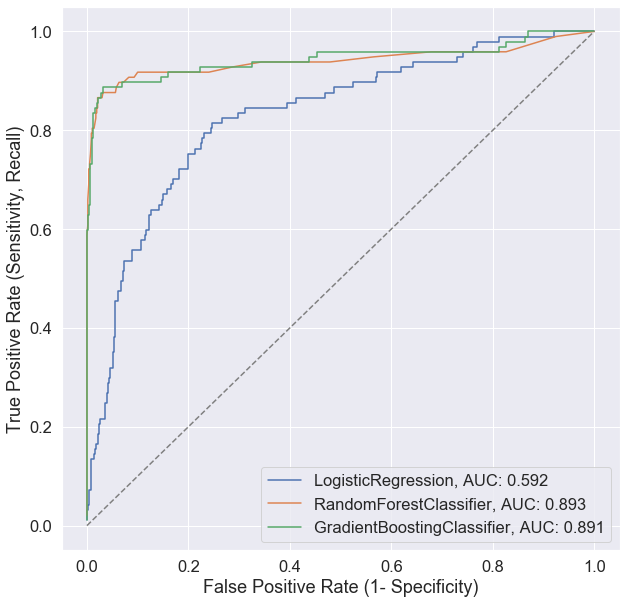
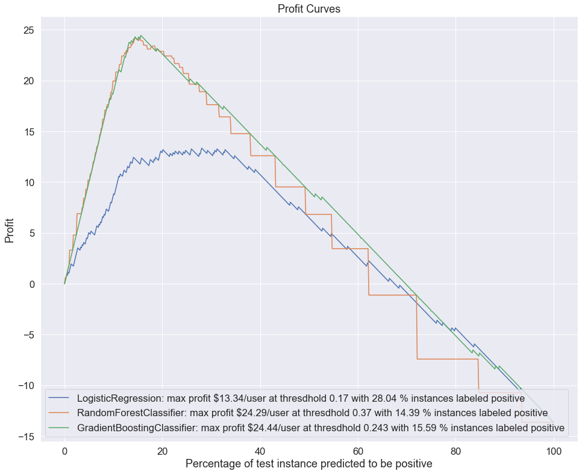
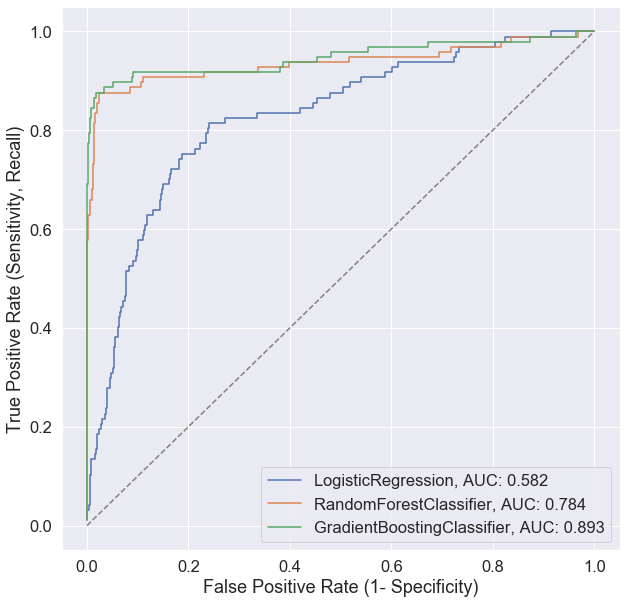
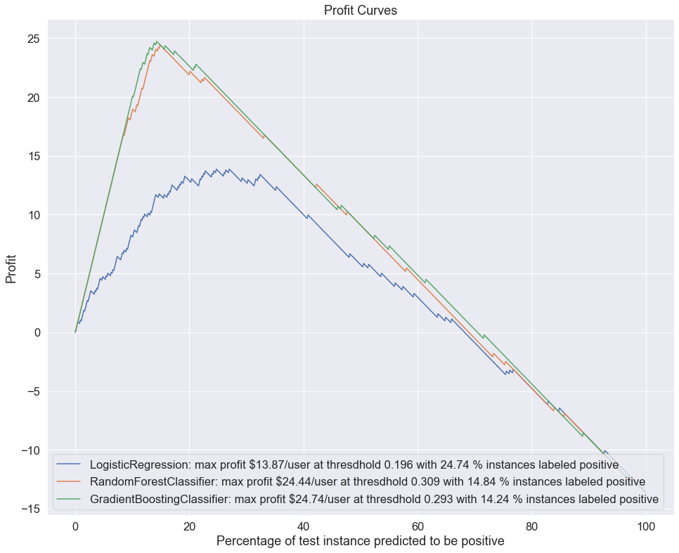

.. name of course

*************************************   
Use cases with pipelines
*************************************

Learning Objectives
======================
+------------------------------+--------------------------------------------------------------------------+
| Data preprocessing mapper    | Build a data preprocessing mapper to convert dataframe into numeric      |
+------------------------------+--------------------------------------------------------------------------+
| Classifiers class            | Build a class/object for easier models comparison                        |
+------------------------------+--------------------------------------------------------------------------+
| Hyperparameters tuning       | Build hyperparameters tuning into classifiers class for easy operation   |
+------------------------------+--------------------------------------------------------------------------+
| Profit Curves                | Use profit curves to select model best for business & to determine budget|
+------------------------------+--------------------------------------------------------------------------+

Motivating Example: How to choose classifiers best for your business?
=====================================================================

You just join a ride-sharing unicorn as a data scientist. Based on a newly pulled data set, you will build models to predict who is likely to churn, so that the company can prevent them by providing incentive.

You look into the data and have the following concerns:

-  Data shows that only small portion of customers churn in the
   past. You expect your predictive models to be classifications with imbalanced
   dataset (majority customers remain while minority churn). What
   metrics should be used to evaluate the performance of your models?

-  By default machine learning algorithms use 50% as classification threshold. i.e.
   a sample will be labled as churn when its predicted probability of being positive is over 50%. You expect this paramenter would have great influence on deciding how many customer being
   predicted to churn and therefore how much incentive package will be
   offered. What threshold will be best for your business?

-  Your company have limited budget to spend on the false positive
   investigation, meaning that the number of instances to investigate would be
   limited. How do you incorporate the budget constrain into model selection?

-  Offering incentive to loyal customer cost your company :math:`$10`
   while preventing a person from churning bring in :math:`$200`. How are you going to use this cost-benefit information to choose a model best to your company?

At the end of the day you should choose a model that will max the profit
for your company while keep the investiation cost under budget.

Loading the packages
------------------------

We will use ``pandas`` for data manipulation, ``matplotlib`` and
``seaborn`` for data visulization, ``sklearn`` for machine learning,
``sklearn_pandas`` and ``sklearn.pipeline`` to set up pipeline.

.. code:: ipython3

    from pandas.plotting import scatter_matrix
    from sklearn.ensemble import GradientBoostingClassifier, RandomForestClassifier
    from sklearn.feature_extraction.text import CountVectorizer
    from sklearn.linear_model import LogisticRegression
    from sklearn.metrics import roc_auc_score, f1_score, confusion_matrix, classification_report
    from sklearn.model_selection import train_test_split, GridSearchCV
    from sklearn.pipeline import Pipeline
    from sklearn.preprocessing import StandardScaler, LabelEncoder, LabelBinarizer
    
    #!pip install sklearn-pandas 
    from sklearn_pandas import DataFrameMapper, cross_val_score
    
    import datetime
    import matplotlib.pyplot as plt
    import numpy as np
    import pandas as pd
    %matplotlib inline
    import seaborn as sns
    sns.set(font_scale=1.5)

Loading Data
-----------------------------

.. code:: ipython3

    df = pd.read_csv('data/churn.csv')
    df.head()

.. raw:: html

    

    
    <table border="1" class="dataframe">
      <thead>
        <tr style="text-align: right;">
          <th></th>
          <th>State</th>
          <th>Account Length</th>
          <th>Area Code</th>
          <th>Phone</th>
          <th>Int'l Plan</th>
          <th>VMail Plan</th>
          <th>VMail Message</th>
          <th>Day Mins</th>
          <th>Day Calls</th>
          <th>Day Charge</th>
          <th>...</th>
          <th>Eve Calls</th>
          <th>Eve Charge</th>
          <th>Night Mins</th>
          <th>Night Calls</th>
          <th>Night Charge</th>
          <th>Intl Mins</th>
          <th>Intl Calls</th>
          <th>Intl Charge</th>
          <th>CustServ Calls</th>
          <th>Churn?</th>
        </tr>
      </thead>
      <tbody>
        <tr>
          <th>0</th>
          <td>KS</td>
          <td>128</td>
          <td>415</td>
          <td>382-4657</td>
          <td>no</td>
          <td>yes</td>
          <td>25</td>
          <td>265.1</td>
          <td>110</td>
          <td>45.07</td>
          <td>...</td>
          <td>99</td>
          <td>16.78</td>
          <td>244.7</td>
          <td>91</td>
          <td>11.01</td>
          <td>10.0</td>
          <td>3</td>
          <td>2.70</td>
          <td>1</td>
          <td>False.</td>
        </tr>
        <tr>
          <th>1</th>
          <td>OH</td>
          <td>107</td>
          <td>415</td>
          <td>371-7191</td>
          <td>no</td>
          <td>yes</td>
          <td>26</td>
          <td>161.6</td>
          <td>123</td>
          <td>27.47</td>
          <td>...</td>
          <td>103</td>
          <td>16.62</td>
          <td>254.4</td>
          <td>103</td>
          <td>11.45</td>
          <td>13.7</td>
          <td>3</td>
          <td>3.70</td>
          <td>1</td>
          <td>False.</td>
        </tr>
        <tr>
          <th>2</th>
          <td>NJ</td>
          <td>137</td>
          <td>415</td>
          <td>358-1921</td>
          <td>no</td>
          <td>no</td>
          <td>0</td>
          <td>243.4</td>
          <td>114</td>
          <td>41.38</td>
          <td>...</td>
          <td>110</td>
          <td>10.30</td>
          <td>162.6</td>
          <td>104</td>
          <td>7.32</td>
          <td>12.2</td>
          <td>5</td>
          <td>3.29</td>
          <td>0</td>
          <td>False.</td>
        </tr>
        <tr>
          <th>3</th>
          <td>OH</td>
          <td>84</td>
          <td>408</td>
          <td>375-9999</td>
          <td>yes</td>
          <td>no</td>
          <td>0</td>
          <td>299.4</td>
          <td>71</td>
          <td>50.90</td>
          <td>...</td>
          <td>88</td>
          <td>5.26</td>
          <td>196.9</td>
          <td>89</td>
          <td>8.86</td>
          <td>6.6</td>
          <td>7</td>
          <td>1.78</td>
          <td>2</td>
          <td>False.</td>
        </tr>
        <tr>
          <th>4</th>
          <td>OK</td>
          <td>75</td>
          <td>415</td>
          <td>330-6626</td>
          <td>yes</td>
          <td>no</td>
          <td>0</td>
          <td>166.7</td>
          <td>113</td>
          <td>28.34</td>
          <td>...</td>
          <td>122</td>
          <td>12.61</td>
          <td>186.9</td>
          <td>121</td>
          <td>8.41</td>
          <td>10.1</td>
          <td>3</td>
          <td>2.73</td>
          <td>3</td>
          <td>False.</td>
        </tr>
      </tbody>
    </table>
    
5 rows × 21 columns

    

.. code:: ipython3

    df.columns

.. parsed-literal::

    Index(['State', 'Account Length', 'Area Code', 'Phone', 'Int'l Plan',
           'VMail Plan', 'VMail Message', 'Day Mins', 'Day Calls', 'Day Charge',
           'Eve Mins', 'Eve Calls', 'Eve Charge', 'Night Mins', 'Night Calls',
           'Night Charge', 'Intl Mins', 'Intl Calls', 'Intl Charge',
           'CustServ Calls', 'Churn?'],
          dtype='object')

.. code:: ipython3

    df.info()

.. parsed-literal::

    <class 'pandas.core.frame.DataFrame'>
    RangeIndex: 3333 entries, 0 to 3332
    Data columns (total 21 columns):
     #   Column          Non-Null Count  Dtype  
    ---  ------          --------------  -----  
     0   State           3333 non-null   object 
     1   Account Length  3333 non-null   int64  
     2   Area Code       3333 non-null   int64  
     3   Phone           3333 non-null   object 
     4   Int'l Plan      3333 non-null   object 
     5   VMail Plan      3333 non-null   object 
     6   VMail Message   3333 non-null   int64  
     7   Day Mins        3333 non-null   float64
     8   Day Calls       3333 non-null   int64  
     9   Day Charge      3333 non-null   float64
     10  Eve Mins        3333 non-null   float64
     11  Eve Calls       3333 non-null   int64  
     12  Eve Charge      3333 non-null   float64
     13  Night Mins      3333 non-null   float64
     14  Night Calls     3333 non-null   int64  
     15  Night Charge    3333 non-null   float64
     16  Intl Mins       3333 non-null   float64
     17  Intl Calls      3333 non-null   int64  
     18  Intl Charge     3333 non-null   float64
     19  CustServ Calls  3333 non-null   int64  
     20  Churn?          3333 non-null   object 
    dtypes: float64(8), int64(8), object(5)
    memory usage: 546.9+ KB

Data preprocessing pipeline
-----------------------------

Create dataframe mapper to map dataframe into numeric values, which is the acceptable format for sklearn algorithms.

.. code:: ipython3

    mapper = DataFrameMapper([
            ('State', LabelEncoder()),
            ('Account Length', None),
            ('Area Code', LabelEncoder()),
            ("Int'l Plan",LabelBinarizer()),
            ('VMail Plan', LabelBinarizer()), 
            ('VMail Message', None), 
            ('Day Mins', None), 
            ('Day Calls', None), 
            ('Day Charge',None),
            ('Eve Mins',None), 
            ('Eve Calls',None), 
            ('Eve Charge',None), 
            ('Night Mins',None), 
            ('Night Calls',None),
            ('Night Charge',None), 
            ('Intl Mins',None), 
            ('Intl Calls',None), 
            ('Intl Charge',None),
            ('CustServ Calls',None) 
            #('Churn?',LabelBinarizer())
        ])
.. note::
     Only columns that are listed in the DataFrameMapper are kept. To keep a column but don't apply any transformation to it, use None as transformer. To learn more about DataFrameMapper, checkout this `documentation <https://github.com/scikit-learn-contrib/sklearn-pandas>`_ and this `example <https://dunyaoguz.github.io/my-blog/dataframemapper.html>`_.
     
     Mapping dataframe to numeric is part of the data preprocessing before applying any machine learning algorithm. As will show in forthcoming section, we will first split data into train and test and then apply the data mapper. It micmics the real life situation where we first train and fit the mapper with existing data and then apply it to future data.

Function Definitions
--------------------

.. code:: ipython3

    def roc_curve(y_proba, y_test):
        '''
        Return the True Positive Rates, False Positive Rates and Thresholds for the
        ROC curve plot.
    
        INPUT y_proba (numpy array): predicted probabilities
        INPUT y_test (numpy array): true labels
        OUTPUT tprs (list):true positive rates, fprs (list): false positive rates, thresholds (list): accendingly sorted y_proba (including 1)
        '''

        thresholds = np.sort(y_proba) 
    
        tprs = []
        fprs = []
    
        num_positive_cases = sum(y_test)
        num_negative_cases = len(y_test) - num_positive_cases
    
        for threshold in thresholds:
            # With this threshold, give the prediction of each instance
            predicted_positive = y_proba >= threshold
            # Calculate the number of correctly predicted positive cases
            true_positives = np.sum(predicted_positive * y_test)
            # Calculate the number of incorrectly predicted positive cases
            false_positives = np.sum(predicted_positive) - true_positives
            # Calculate the True Positive Rate
            tpr = true_positives / float(num_positive_cases)
            # Calculate the False Positive Rate
            fpr = false_positives / float(num_negative_cases)
    
            fprs.append(fpr)
            tprs.append(tpr)
    
        return tprs, fprs, thresholds.tolist()
    
    def plot_roc_curve(pipeline, y_pred, y_proba, y_test):
        '''
        Plot ROC curve with data from function above.
        '''
        tpr, fpr, thresholds = roc_curve(y_proba, y_test)
    
        model_name = pipeline.named_steps['classifier'].__class__.__name__
        auc = round(roc_auc_score(y_test, y_pred), 3)
        plt.plot(fpr, tpr, label='{}, AUC: {}'.format(model_name, auc))

    def standard_confusion_matrix(y_true, y_pred):
        '''
        standard confusion matrix organized as [[tp,fp],[fn,tn]] can be converted from
        sklearn confusion matrix which is organized as [[tn,fp],[fn,tp]] 
        '''
        [[tn, fp], [fn,tp]] = confusion_matrix(y_true, y_pred)
        return np.array([[tp,fp], [fn,tn]])
    
    def profit_curve(cost_benefit_matrix, y_prob, y_test):
        """ To calculate list of profits based on supplied cost-benefit
        matrix and prediced probabilities of data points and their true labels.
    
        Parameters
        ----------
        cost_benefit_matrix    : ndarray - 2D, with profit values corresponding to:
                                              -----------
                                              | TP | FP |
                                              -----------
                                              | FN | TN |
                                              -----------
        y_prob : ndarray - 1D, predicted probability for each datapoint
                                        in labels, in range [0, 1]
        y_test : ndarray - 1D, true label of datapoints, 0 or 1
    
        Returns
        -------
        profits    : ndarray - 1D
        thresholds : ndarray - 1D
        """
        n_obs = float(len(y_test))
        
        #making sure 1 is one of our threshold
        maybe_one = [] if 1 in y_prob else [1]
        thresholds = maybe_one + sorted(y_prob, reverse=True)
        
        profits = []
        for threshold in thresholds:
            y_pred = y_prob>=threshold
            confusion_matrix=standard_confusion_matrix(y_test, y_pred)
            profit = np.sum(cost_benefit_matrix*confusion_matrix)/n_obs
            profits.append(profit)
        return np.array(profits), np.array(thresholds)
    
    def plot_profit_curve(pipeline, cost_benefit_matrix, y_prob, y_test):
        '''
        Plot profit curve with 
        - x-axis: the percent of test instance being predicted as positive.
        - y-axis: the profits
    
        INPUTS:
        - pipeline: pipeline object
        - cost_benefit_matrix: cost benefit matrix in the same format as the confusion matrix above
        - y_prob: predicted probabilities of the instances being positive
        - y_test: actual labels (positive being 1 and negative being 0)
        '''
    
        profits, thresholds = profit_curve(cost_benefit_matrix=cost_benefit_matrix, 
                                           y_prob=y_prob,
                                           y_test=y_test)
    
        # Profit curve plot
        model_name = pipeline.named_steps['classifier'].__class__.__name__
        max_profit = max(profits)
        profit_threshold_percent_max = [(round(profit,2), round(threshold,3), round(percent,2)) for profit, threshold, percent in zip(profits, thresholds, np.linspace(0, 100, len(profits))) if profit == max_profit][0]
        #plt.figure(figsize=(12,8))
        plt.plot(np.linspace(0, 100, len(profits)), profits, label = f'{model_name}: max profit ${profit_threshold_percent_max[0]}/user at thresdhold {profit_threshold_percent_max[1]} with {profit_threshold_percent_max[2]}% instances labeled positive')
        plt.legend()
        plt.xlabel('Percentage of test instances predicted as positive')
        plt.ylabel('Profit (in Dollar)')
        #plt.show()
    
    
    def transform_dict_keys(dic):
        '''
        transform the keys of a dictionary by deleting "classifier__"
        Example:
        dic = {'classifier__bootstrap': True,
             'classifier__max_depth': 4,
             'classifier__max_features': 'sqrt',
             'classifier__min_samples_leaf': 1,
             'classifier__min_samples_split': 4,
             'classifier__n_estimators': 50,
             'classifier__n_jobs': -1,
             'classifier__oob_score': True,
             'classifier__random_state': 67}
    
        transform_dict_keys(dic)
        
        '''
        return dict((key.replace('classifier__',''), value) for (key,value) in dic.items())
    

Model Classifier Object
-----------------------

We use class/object to store our models for simpler comparison.

.. code:: ipython3

    class Classifiers():
        '''
        Classifier object is used to fit, store and compare multiple models.
        '''
        def __init__(self, classifiers, classifier_params=None):
            self.classifiers = classifiers #list of classifiers
            self.classifier_names = [classifier.__class__.__name__ for classifier in self.classifiers]
            self.pipelines = [] # list of pipeline objects for classifiers
            self.classifier_params = classifier_params #list of dictionary of hyperparameters for each classifier to be tunes by GridSearchCV()
            
        def create_pipelines(self, mapper):
            for classifier in self.classifiers:
                self.pipelines.append(
                Pipeline([
                    ('featurize', mapper),
                    ('scale', StandardScaler()),
                    ('classifier', classifier)   
                ]))
            
        def train(self, X_train, y_train):
            for pipeline in self.pipelines:
                pipeline.fit(X_train, y_train)
            return self
        
        def accuracy_scores(self, X_test, y_test):
            self.accuracies = [] # list to store test scores
            
            for pipeline in self.pipelines:
                self.accuracies.append(pipeline.score(X_test, y_test))
                
            #print accuracy results
            accu_df = pd.DataFrame(zip(self.classifier_names, self.accuracies))
    
            accu_df.columns = ['Classifier', 'Test Accuracy']
            print(accu_df)
            
        def classification_reports(self, X_test, y_test):
            self.classification_reports = []
            
            for pipeline in self.pipelines:
                y_pred = pipeline.predict(X_test)
                self.classification_reports.append(classification_report(y_test, y_pred))
            
            #print  reports
            for name, report in zip(self.classifier_names, self.classification_reports):
                print(f'------------{name}-------------')
                print(report)
           
            
        def plot_roc_curves(self, X_test, y_test):
            #Plot ROC curve for each classifier
            plt.figure(figsize=(10,10))
            for pipeline in self.pipelines:
                y_pred = pipeline.predict(X_test)
                y_prob = pipeline.predict_proba(X_test)[:,1]
                plot_roc_curve(pipeline, y_pred, y_prob, y_test)
                
            # 45 degree line
            x = np.linspace(0, 1.0, 20)
            plt.plot(x, x, color='grey', ls='--')
            
            # Plot labels
            plt.xlabel('False Positive Rate (1- Specificity)')
            plt.ylabel('True Positive Rate (Sensitivity, Recall)')
            plt.legend(loc='lower right')
            plt.show()
       
    
    
        
        def plot_profit_curves(self, cost_benefit_matrix, X_test, y_test):
            #plot profit curve for each classifier
            plt.figure(figsize=(16,13))
            for pipeline in self.pipelines:
                y_prob = pipeline.predict_proba(X_test)[:,1]
                plot_profit_curve(pipeline, cost_benefit_matrix, y_prob, y_test)
    
            plt.xlabel('Percentage of test instance predicted to be positive')
            plt.ylabel('Profit')
            plt.title('Profit Curves')
            plt.legend(loc='lower left')
            plt.show()
            
        def tune_train_classifiers(self, mapper, X_train, y_train, scoring):
            '''
            Tuning hyperparameters for each classifier and output the best parameters set and best model
            scoring could also be 'f1', 'roc_auc', etc.
            
            '''
            ls_best_params = []
            ls_best_mdl = []
            
            for (classifier, params) in zip(self.classifiers, self.classifier_params):
                pipeline = Pipeline([
                                ('featurize', mapper),
                                ('scale', StandardScaler()),
                                ('classifier', classifier)
                                ])
    
                clf_grid = GridSearchCV(pipeline, params, scoring=scoring)
                clf_grid = clf_grid.fit(X_train, y_train)
    
                best_clf_model = clf_grid.best_estimator_
                best_clf_params = clf_grid.best_params_
                best_clf_params = transform_dict_keys(best_clf_params)
                ls_best_params.append(best_clf_params)
                ls_best_mdl.append(best_clf_model)
            
            #replace any existing pipelines with the tuned & trained ones
            self.pipelines = ls_best_mdl
            self.classifier_best_params = ls_best_params
            return self

We will compare the following models: 

- Logistic Regress 

- Random Forest

- Gradient Boosting

Model Training & Model Selection
==================================

0. Split data into train set and test set
--------------------------------------------------

.. code:: ipython3

    X = df.copy()
    y = X.pop('Churn?')

.. code:: ipython3

    y = y.map({'True.': 1, 'False.': 0})

.. code:: ipython3

    X_train, X_test, y_train, y_test = train_test_split(X, y, test_size=0.2, random_state=123, stratify=y)

1. Train models on the train set
---------------------------------

.. code:: ipython3

    # create list of classifiers
    lr = LogisticRegression()
    rf = RandomForestClassifier()
    gb = GradientBoostingClassifier()
    
    clfs = Classifiers([lr, rf, gb])

.. code:: ipython3

    # create pipelines
    clfs.create_pipelines(mapper)

.. code:: ipython3

    # train classifiers
    clfs.train(X_train, y_train)

.. parsed-literal::

    <__main__.Classifiers at 0x1a252d95d0>

2. Compare models' metrics on the test set
------------------------------------------------

.. code:: ipython3

    clfs.classification_reports(X_test, y_test)

.. parsed-literal::

    ------------LogisticRegression-------------
                  precision    recall  f1-score   support
    
               0       0.88      0.98      0.93       570
               1       0.61      0.21      0.31        97
    
        accuracy                           0.87       667
       macro avg       0.74      0.59      0.62       667
    weighted avg       0.84      0.87      0.84       667
    
    ------------RandomForestClassifier-------------
                  precision    recall  f1-score   support
    
               0       0.97      0.99      0.98       570
               1       0.93      0.79      0.86        97
    
        accuracy                           0.96       667
       macro avg       0.95      0.89      0.92       667
    weighted avg       0.96      0.96      0.96       667
    
    ------------GradientBoostingClassifier-------------
                  precision    recall  f1-score   support
    
               0       0.97      0.99      0.98       570
               1       0.93      0.79      0.86        97
    
        accuracy                           0.96       667
       macro avg       0.95      0.89      0.92       667
    weighted avg       0.96      0.96      0.96       667
    
The classification reports show that RandomForest and GradientBoosting have identical performance metrics and they are the winner. 

3. Compare models' ROC curves
---------------------------------

.. code:: ipython3

    clfs.plot_roc_curves(X_test, y_test)

The AUC-ROC curves show that RandomForest slightly out performs GradientBoosting.

4. Compare models' profit curves
-------------------------------------

.. code:: ipython3

    cost_benefit_mat = np.array([[200,-50], 
                                 [0, 0]])

.. code:: ipython3

    clfs.plot_profit_curves(cost_benefit_mat, X_test, y_test)

The profit curves show that GradientBoosting achives slightly higher max profit per user than RandomForest (by $0.15). More over, GradientBoosting model expects labeling 15.59% instances positive v.s. RandomForest 14.39%. For every one million instances in future data, the budget of GradientBoosting is 1000000*0.1559*10 = 1.559 million dollars for incentive which is higher than the budget of RandomForest, 1000000*0.1439*10 = 1.439 million dollars.  

One-stop tune & train classifiers
=================================

We can easily tune and train models by using the class API.

.. code:: ipython3

    
    
    # Provide a list of classifiers 
    clfs = [LogisticRegression(), RandomForestClassifier(), GradientBoostingClassifier()]
    
    # Provide a list of parameters-dictionaries (corresponding to the classifiers)
    
    lr_params = {'classifier__penalty' : ['l1', 'l2'],
                 'classifier__C' : np.logspace(-4, 4, 20),
                 'classifier__solver' : ['liblinear']}
    
    
    rf_params = {
        'classifier__max_depth': [4,6, 8, None],
        'classifier__max_features': ['sqrt', 'log2', 'auto'],
        #'classifier__min_samples_split': [1.0, 2.0, 4.0],
        #'classifier__min_samples_leaf': [1, 2, 4],
        'classifier__bootstrap': [True], # Mandatory with oob_score=True
        'classifier__n_estimators': [50, 100],
        'classifier__random_state': [123],
        'classifier__oob_score': [True],
        'classifier__n_jobs': [-1]
        }
    
    gb_params = {
        'classifier__learning_rate': [1.0, 0.01],
        'classifier__max_depth': [1, 6, 8],
        'classifier__min_samples_leaf': [2],
        'classifier__max_features': ['sqrt', 'log2', 'auto'],
        'classifier__n_estimators': [500, 1000],
        'classifier__subsample': [0.25, 0.5]
    }
    
    clf_params = [lr_params, rf_params, gb_params]
    
    
    # Create classifiers object 
    clfs_best = Classifiers(classifiers=clfs, classifier_params=clf_params)

.. code:: ipython3

    # Tune and train classifiers
    clfs_best.tune_train_classifiers( mapper, X_train, y_train, scoring='roc_auc')

Now we compare models' performance by classification reports:

.. code:: ipython3

    clfs_best.classification_reports(X_test, y_test)
    

.. parsed-literal::

    ------------LogisticRegression-------------
                  precision    recall  f1-score   support
    
               0       0.88      0.98      0.92       570
               1       0.60      0.19      0.28        97
    
        accuracy                           0.86       667
       macro avg       0.74      0.58      0.60       667
    weighted avg       0.84      0.86      0.83       667
    
    ------------RandomForestClassifier-------------
                  precision    recall  f1-score   support
    
               0       0.93      1.00      0.96       570
               1       1.00      0.57      0.72        97
    
        accuracy                           0.94       667
       macro avg       0.97      0.78      0.84       667
    weighted avg       0.94      0.94      0.93       667
    
    ------------GradientBoostingClassifier-------------
                  precision    recall  f1-score   support
    
               0       0.97      0.99      0.98       570
               1       0.96      0.80      0.88        97
    
        accuracy                           0.97       667
       macro avg       0.97      0.90      0.93       667
    weighted avg       0.97      0.97      0.97       667
    
GradientBoosting classifier achieves the best performance on f1-score and recall on positive class.

We can compare and select models through AUC curves and profit curves.

.. code:: ipython3

    # plot ROC curves 
    clfs_best.plot_roc_curves(X_test, y_test)
    

GradientBoosting achieve the highest AUC among the three but it's only slightly higher than using default hyperparameters (0.893 v.s. 0.891). It indicates that we may need to expand the searching range to achieve significant better result than the default.

.. code:: ipython3

    #Plot profit curves
    cost_benefit_mat = np.array([[200,-50], 
                                 [0, 0]])
    clfs_best.plot_profit_curves(cost_benefit_mat, X_test, y_test)

The profit curves show that GradientBoosting achives slightly higher max profit per user than RandomForest (by $0.15). More over, GradientBoosting model expects labeling 14.24% instances positive v.s. RandomForest 14.84%. For every one million instances in future data, the budget of GradientBoosting is 1000000*0.1424*10 = 1.424 million dollars for incentive which is lower than the budget of RandomForest, 1000000*0.1484*10 = 1.484 million dollars.  

Useful Readings
=================

`User Churn Prediction: A Machine Learning Example <https://carmenlai.com/2016/11/12/user-churn-prediction-a-machine-learning-workflow.html>`_

