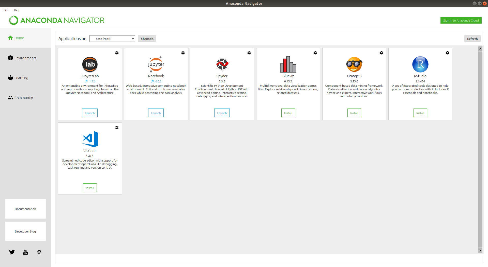
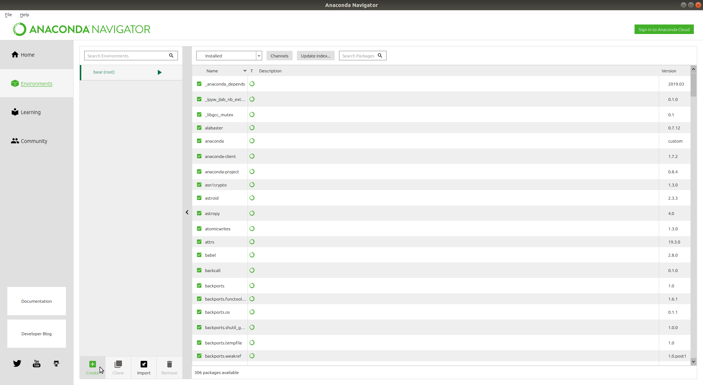
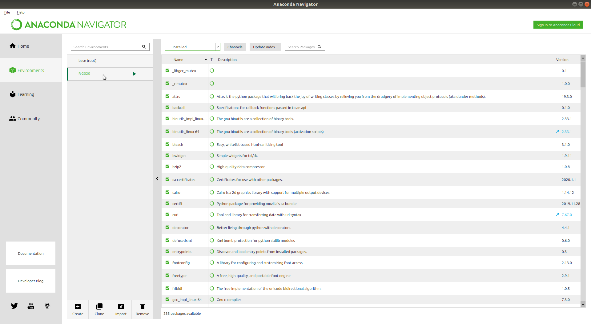

***********************
Environment and Setup
***********************

Learning objectives
=====================

+---------+-------------------------------------------------------------------------------------------------------+
| 1       | Install and maintain an R environment that readily works with Jupyter, RStudio and scripting          |
+---------+-------------------------------------------------------------------------------------------------------+

Install guide
=================

In this section we will install several distinct components to arrive at a development environment that works for both
R and Python.  During this install process we accommodate both of these environments for several reasons:

    1. Many students and data scientists already have a working Python environment
    2. `Anaconda <https://docs.anaconda.com/anaconda/>`_ is a convenient way to manage both Python and R
    3. We will demonstrate how to access R from Python and Python from R in this course

.. warning::

    If you already have working Python and R environment you may skip this section, but you should at least read the
    contents to ensure that you have an environment that is compatible with these learning materials.

Process outline
-------------------

    1. Install Anaconda
    2. Create an R environment with RStudio
    3. Install Git (and Git)

Step 1 - Install Anaconda
---------------------------

If you already have a version of Anaconda and you would like to start fresh use the following command (from a terminal)
to remove the old version.

.. code-block::
   bash

   ~$ rm -rf ~/anaconda*

.. hint::

    On Windows, macOS, and Linux, it is best to install Anaconda for the local user.  This type of install **does not**
    require administrator permissions. However, if you need to, you can install Anaconda system wide, which does
    require administrator permissions.  See the `Anaconda install docs <https://docs.anaconda.com/anaconda/install/>`_
    for more information.

Once you have installed the package Anaconda you will be using `conda <https://conda.io/en/latest>`_ to manage the
packages in your environment.  Anaconda is a powerful data science platform that allows you to maintain
`several versions of Python <https://docs.anaconda.com/anaconda/navigator/tutorials/use-multiple-python-versions/>`_.
Let's get started by installing the Anaconda package.

Anaconda for Windows
^^^^^^^^^^^^^^^^^^^^^^

1. Open https://www.anaconda.com/download/#windows
2. Download the Python 3 installer for Windows.
3. Install Python 3 using all of the defaults for installation except make sure to check
   **Make Anaconda the default Python**.

Anaconda for Mac OS
^^^^^^^^^^^^^^^^^^^^^^
1. Open https://www.anaconda.com/download/#macos
2. Download the Python 3 installer for OS X.
3. Install Python 3 using all of the defaults for installation.

Anaconda for Linux
^^^^^^^^^^^^^^^^^^^^^^^

1. Open https://www.anaconda.com/download/#linux
2. Download the Python 3 installer for Linux.
3. Install Python 3 using all of the defaults for installation.
4. Open a terminal window and navigate to the downloads folder where you enter the following command.

.. code-block::
    bash

    ~$ bash Anaconda3-20XX.XX-Linux-x86_64.sh

.. note::

    The exact file name will depend on the version of Anaconda that you downloaded.

5. Follow the prompts ensuring that you prepend Anaconda to your PATH (this makes the Anaconda distribution the
default Python).

Step 2 - Create an R environment with RStudio
--------------------------------------------------

We will install the R environment from the `Anaconda Navigator <https://docs.anaconda.com/anaconda/navigator/>`_.  It
is a desktop graphical user interface (GUI) included in the Anaconda install that you just carried out.  If you are
unsure where to find and/or how to start the Navigator see this
`guide for using the navigator <https://docs.anaconda.com/anaconda/navigator/getting-started/>`_. From Windows you can
find it using the *Start Menu*.  In MacOS it can be found under *Applications*.  Under both MacOS and Linux distros
it can be started from the command line with.

.. code-block::
    bash

    ~$ anaconda-navigator

Once you have the navigator open it will look like this:

The directions for creating an
`R environment using the navigator <https://docs.anaconda.com/anaconda/navigator/tutorials/create-r-environment/>`_
are detailed and can be referenced if you run into trouble.  The following next steps mirror the referenced
documentation.

1. In Navigator, click the Environments tab, then click the Create button. The Create new environment dialog box appears.

A small window will appear.

2. In the Environment name field, type a descriptive name for your environment like `R-2020`
3. In the Packages list, select `R`

.. hint::

    On some operating systems you will have a choice for the distribution of R.  We suggest using `r` which corresponds
    to the packages `r-base` and `r-essentials`.

4. Click on the create button (this will take some time to complete).
5. The navigator will creates the new environment and activates it (indicated by the highlighted green bar).

6. With the new environment active, click the Home button and then click the `Install` button on the RStudio application.

.. tip::

    You may also install any other software, like JupyterLab, that you might use as part of your development environment.

You should test that RStudio and Jupyter notebook are functioning properly.  On the appropriate `Launch` icons.  We will
cover the details of how to use these environments in the next unit.

.. tip::

    Feel free to leave open your Jupyter notebook and RStudio session.  In the next section you will run a quick test
    to ensure they are working properly.

Step 3 - Install Git
--------------------------

Git is a `version control <https://en.wikipedia.org/wiki/Version_control>`_ system that lets you track changes to files
containing text.  Often these files are scripts or other files that contain computer programming code.
`Git <https://git-scm.com/>`_ through the use of `GitHub <https://github.com/>`_ helps enable collaboration, resource
sharing and reproducible analytics.  You will need a
`GitHub supported web browser <https://help.github.com/en/enterprise/2.15/user/articles/supported-browsers>`_ to complete
the assignments and tasks that are part of this learning experience.  You will also need to
`sign up for a GitHub account <https://github.com/join>`_ if you do not have one already.  Basic GitHub accounts are
free. Please create one now if you do not have one already.

.. tip::

    There are a number of settings associated with your GitHub account.  For example, if you would like to keep your
    email address private see the `setting your email address documentation <https://help.github.com/en/github/setting-up-and-managing-your-github-user-account/setting-your-commit-email-address>`_.

Git for Windows
^^^^^^^^^^^^^^^^^^^^

    1. Download the `Git for Windows installer <https://git-for-windows.github.io/>`_.
    2. Run the installer and follow the steps below:
    3. Click on "Next" four times (two times if you've previously installed Git). You don't need to change anything in
       the Information, location, components, and start menu screens.
    4. Select "Use the nano editor by default" and click on `Next`.

    .. important::

        Keep **Use Git from the Windows Command Prompt** selected and click on `Next`. If you forgot to do this programs
        that you need for the workshop will not work properly. If this happens rerun the installer and select the
        appropriate option.

    5. Click on `Next`. Keep **Checkout Windows-style, commit Unix-style line endings** selected and click on `Next`.
       Select **Use Windows' default console window** and click on `Next`.

    6. Click on `Install`.
    7. Click on `Finish`.

If your "HOME" environment variable is not set (or you don't know what this is):

1. Open command prompt (Open Start Menu then type cmd and press [Enter])
2. Type the following line into the command prompt window exactly as shown:

.. code-block::
    bash

    ~$ setx HOME "%USERPROFILE%"

3. Press `[Enter]` and you should see `SUCCESS: Specified value was saved`.

4. Quit command prompt by typing `exit` then pressing `[Enter]` This will provide you with both Git and
Bash in the Git Bash program.

Git for MacOS
^^^^^^^^^^^^^^^^^^^^

If it is not already on your machine install `Homebrew <https://brew.sh/>`_ (another package manager).

.. code-block::
    bash

    ~$ /usr/bin/ruby -e "$(curl -fsSL https://raw.githubusercontent.com/Homebrew/install/master/install)"

Then install Git

.. code-block::
    bash

    ~$ brew install git

Git for Ubuntu Linux

.. code-block::
    bash

    ~$ sudo apt install git-all

See the `installing Git documentation <https://git-scm.com/book/en/v2/Getting-Started-Installing-Git>`_ for more
information and troubleshooting.

Keeping everything updated
================================

Updating Python packages
----------------------------

.. code-block::
    bash

    ~$ conda update --all

Updating R packages
-----------------------

.. code-block::
    bash

    ~$ conda update r-caret

Additional Resources
=======================

    * `Anaconda User Guide <https://docs.anaconda.com/anaconda/user-guide/>`_
    * `To integrate Anaconda with an IDE <https://docs.anaconda.com/anaconda/user-guide/tasks/integration/>`_
    * `Anaconda's Docker images <https://docs.anaconda.com/anaconda/user-guide/tasks/docker/>`_
