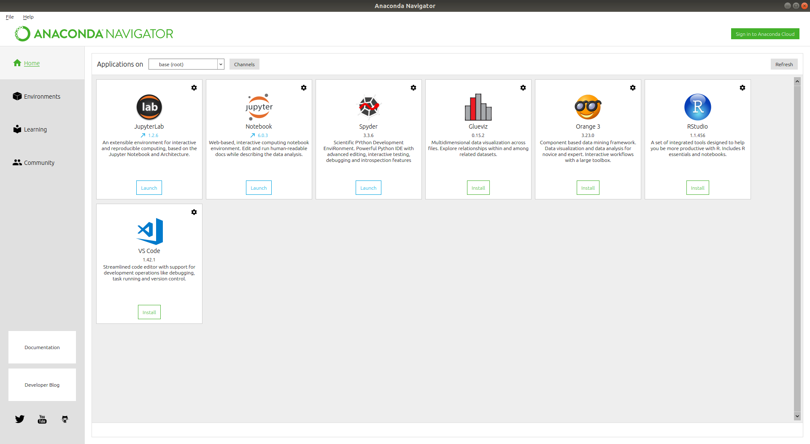

*******************
Getting Started
*******************

Learning objectives
=====================

+---------+-------------------------------------------------------------------------------------------------------+
| 1       | Run 'hello world' programs from Jupyter and RStudio                                                   |
+---------+-------------------------------------------------------------------------------------------------------+

Resources and learning R
==========================

The central resource and official website for the R programming language is
`https://www.r-project.org <https://www.r-project.org/>`_.  You can install packages, find documentation and use it to
locate the various resources associated with R.  We will discuss installation and the R package environment in the next
section.  Traditionally the R language was learned through some combination of textbooks and formal university-level
courses in statistics.  Today many data scientists and aspiring data scientists *learn* through additional online
resources.  The `r-bloggers <https://www.r-bloggers.com>`_ website created by Tal.Galili is a particularly important
resource to keep in mind as `it has numerous tutorials <https://www.r-bloggers.com/how-to-learn-r-2/>`_, updates and
other useful information.

A starting point
====================

R is an `interpreted language <https://en.wikipedia.org/wiki/Interpreted_language>`_, which means that it uses an
`interpreter <https://en.wikipedia.org/wiki/Interpreter_(computing)>`_ to execute instructions written as code.  Other
languages like Java need to be translated first before use and this is carried out using a
`compiler <https://en.wikipedia.org/wiki/Compiler>`_.  Interpreted languages are executed directly with the translation
step occurring at execution.  It is also worth noting that it is not the language itself that is interpreted or compiled
it is the *implementation* of that language.  The commonly used implementations of R are interpreted and we will see in
this unit that it allows for some flexibility in the different ways you can use the language.

First let's access an `interactive environment` to test R.  To do this you will need to open a *terminal*.  On MacOS
and Linux distributions this is intuitive.  If you are working on a Windows machine and if you followed
the environment setup in the previous unit then you will have Git Bash available.  As a reminder on Windows you may:

1. Click the Windows or Start icon.
2. In the Programs list, open the Git folder.
3. Click the option for Git Bash.

Once you have opened a terminal try typing the command `R` and then press `[ENTER]`.  If your environment is
properly setup you will see something like the following.

Before we get into the details of R lets assume for simplicity that the interactive environments are like a
calculator.   Certainly you can do far more here than you can do with a calculator, but as a simple test
enter a simple arithmetic calculation like `7*6` and hit `[ENTER]`.  We will come back to the command line later in
this unit, but for now this simple test was all that was needed to get started.

Let's now go back to the anaconda-navigator.

Working with Jupyter
========================

`Jupyter <https://jupyter.org/>`_ notebooks are a convenient way to mix text (comments, descriptions, introductions etc)
with code.  From the anaconda-navigator open a Jupyter Notebook and try out a few more arithmetic calculations.

.. important::

    When you start your notebook from the anaconda-navigator make sure that you select the `R` kernel.

The contents of a Jupyter notebook are compartmentalized into *cells*.  Each cell can be of the type `MarkDown` or
`Code`.  Try creating a few of each type of cell.  Now try an example that is a few lines of code.

In the first code cell type the following:

.. code-block:: r

    library(dplyr)
    iris

In a different code cell type the following:

.. code-block:: r

    library(ggplot2)
    ggplot(data=iris, aes(x=Sepal.Length, y=Sepal.Width, color=Species)) + geom_point(size=3)

This is a visualization of the Iris data set.  You will understand shortly more about the code itself, but for now
note the ease with which a decent visualization could be created.

Working with RStudio
========================

From the anaconda-navigator 'launch' RStudio from the icon.  You will see that it is an interactive environment like
you saw with the terminal version of R.  Copy the 4 lines of code from the Jupyter exercise into the interactive
console.

If you executed the code correctly the plot should have shown up on the right hand side of the environment.  RStudio
is actually an integrated development environment (IDE) that also includes a editor complete with syntax highlighting.

Saving you code as a file
============================

We mentioned that Git and GitHub are designed to work with text files.  That means in order for you to leverage version
control you will need to save your important code within files.

1. From within RStudio got to `File --> New File --> RScript`.  This will open an empty file.
2. Copy the four lines of code from above into that file.
3. Highlight all of the code then click on the `Run` button

Exiting from R
==================

If you want to exit from an R environment and you are in the interactive terminal environment simply type `q()`.  If
you are in Jupyter you will click on the `running` tab in the home page for Jupyter and shutdown the appropriate
running kernel.  In RStudio click on `File --> Quit Session`.

Additional Resources
=======================

    * `KDnuggets: R vs Python in Data Science <http://www.kdnuggets.com/2015/05/r-vs-python-data-science.html>`_
